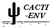
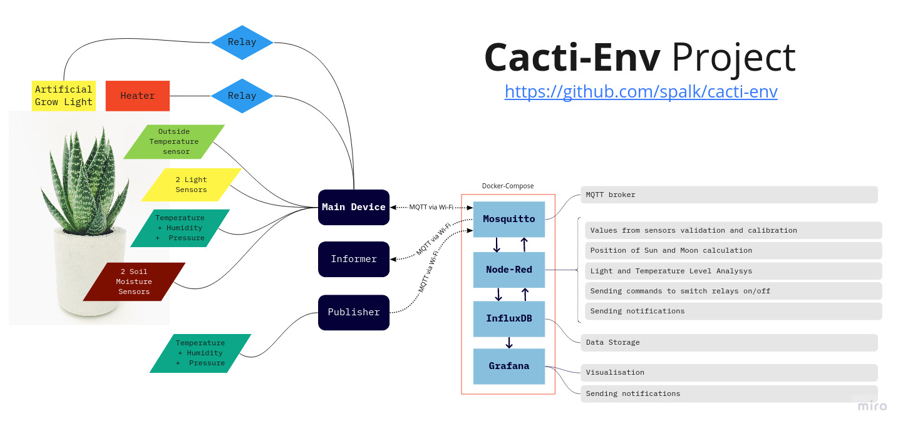

Cacti-Env 
=========
_Succulents and cacti indoor environment monitoring_

The main idea of project is to monitor environment around plants indoors and improve conditions where they live in three steps:

### First step: data collecting

The monitored parameters are:
- temperature
- light level
- relative humidity
- soil moisture

There are also other additional parameters taken into account:
- atmospheric pressure
- outside temperature
- position of sun 
- position of moon
   
All of this parameters a recorded every minute. 

### Second step: data analysing

For each parameters are defined theoretical ranges, when plants feel happy. This ranges can be adjusted according to visual conditions of plants or fresh theoretical information.

Ranges of parameters are also depend on season of the year and dormancy period of the plants. For instance winter temperature for succulents should be 10-15 degrees Celsius when they usually dormant, in summer more than 25 when they usually active grow. 

### Third step: action

In cases when some parameter is out of range actions taken to return it to normal value. 

For light deficiency compensation are used artificial grow lights. For temperature control can be used heaters. Watering can be adjusted manually according to current environment conditions and time of the year. 

------

## How it works 

1. Main device is multi-sensor electronic tool, based on ESP32 microchip. It provides the majority of information about environment condition by publishing it via MQTT protocol using Wi-Fi. It also shows all current values on built-in display with backlight. 
2. Node-Red is subscribed to all sensor subjects. It implements several functions:
    - validates values and save it to database InfluxDB;
    - analyzes values and can send signal to on/off relays to normalize environment conditions if it's needed.
    - calculat additional data such as Sun altitude and azimuth for more accurate light condition assessment   
3. Grafana beautifully shows all collected data and how efficient automation works.  If some parameter is out of normal range, it can send notification via Telegram Messenger.
4. Additional device **Publisher** is optional. One or more can be used if information from main device is not enough.  
5. Additional device **Informer** is just for more convenience. It shows actual value on bright informative display. 
   