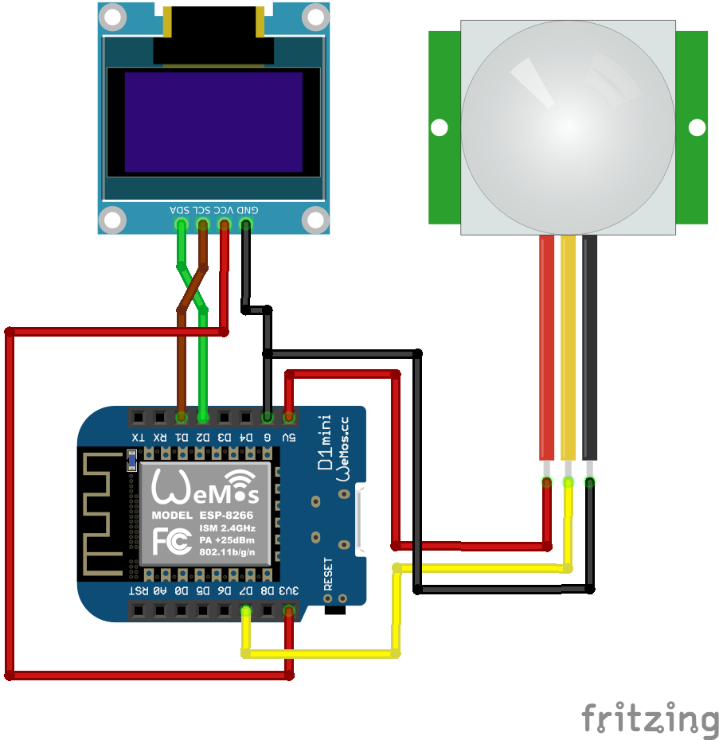
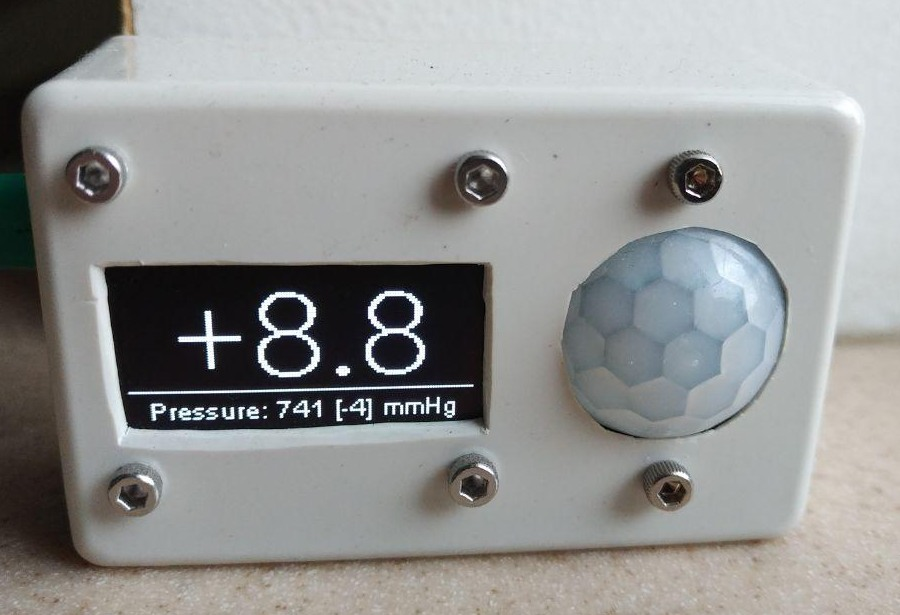

- PIR connection and code: 
www.esp8266learning.com/wemos-mini-pir-sensor-example.php

- OLED library with some modifications of settings
https://github.com/ThingPulse/esp8266-oled-ssd1306
https://www.teachmemicro.com/1-3-i2c-oled-arduino-esp8266-tutorial/

- Font converter:  
http://oleddisplay.squix.ch/#/home

- Wiring: 

- Device:
