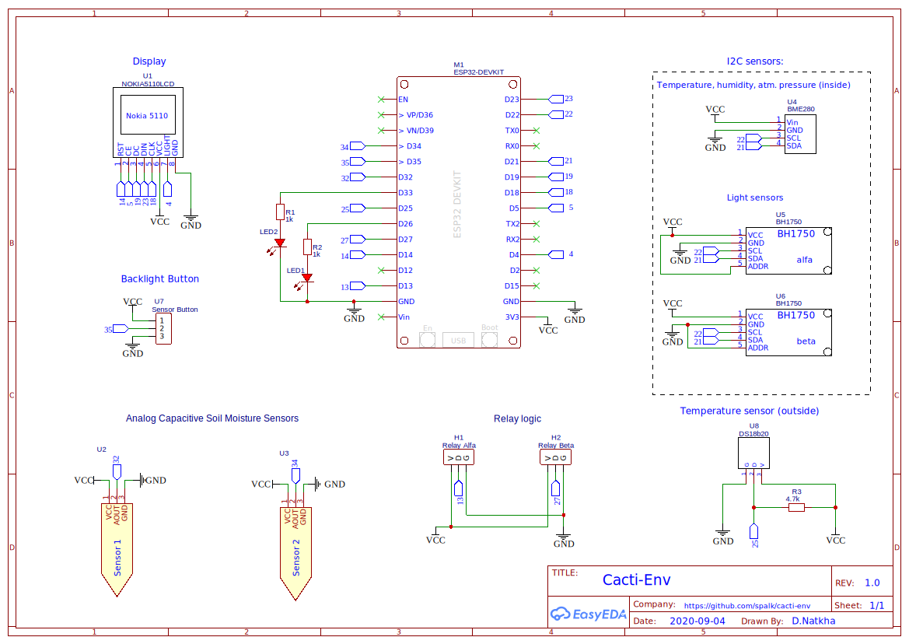
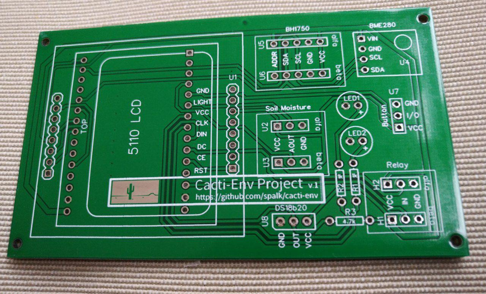
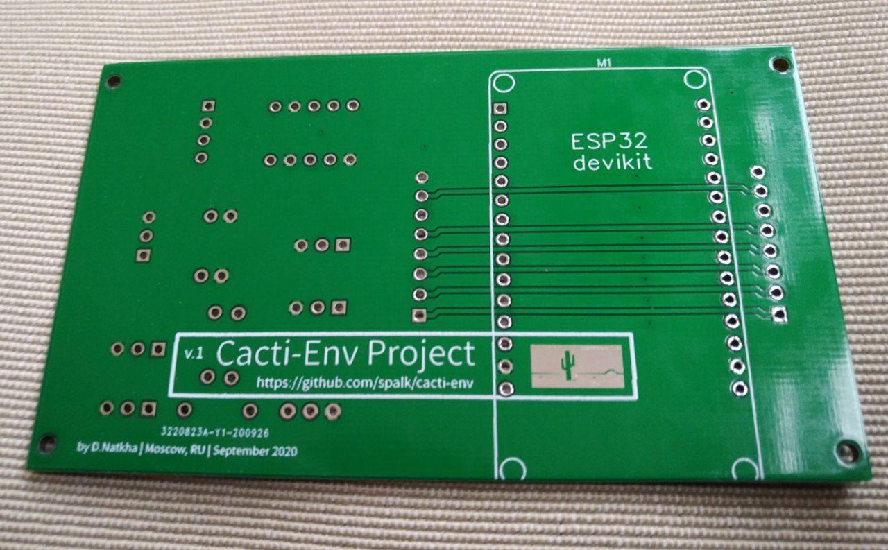
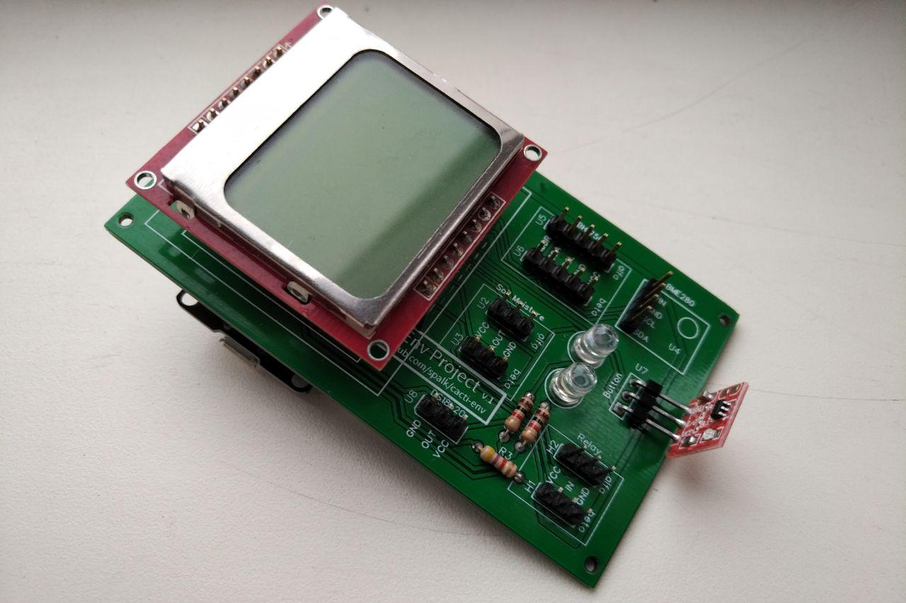

## Main Device information

- core: ESP32 Microcontloller in devkit formfactor
- display: Nokia 5110
- 2 light sensors: BH1750 
- 2 soil moisture sensors: analog capacitive 
- temperature sensor for outside: DB18b20
- pressure, humidity, temperature sensor: BME280
- 1 sensor button for display backlight on/off 
- two output blocks for relay control

### Schemactic: 

### PCB Prototype:

### Real PCB:

### First assembly
  
  

