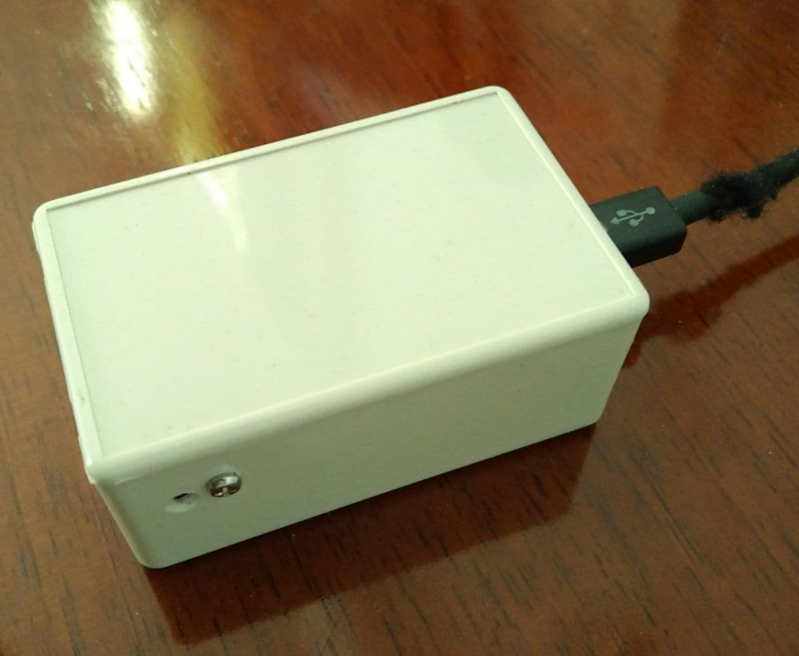

# Publisher Device

It is an optional device, based on esp8266 microchip (Wemos). It is just an extension of sensor set in you IoT environment. In this case in publishes values from one more bme280 sensor. That's why it has a hole on one side.  

